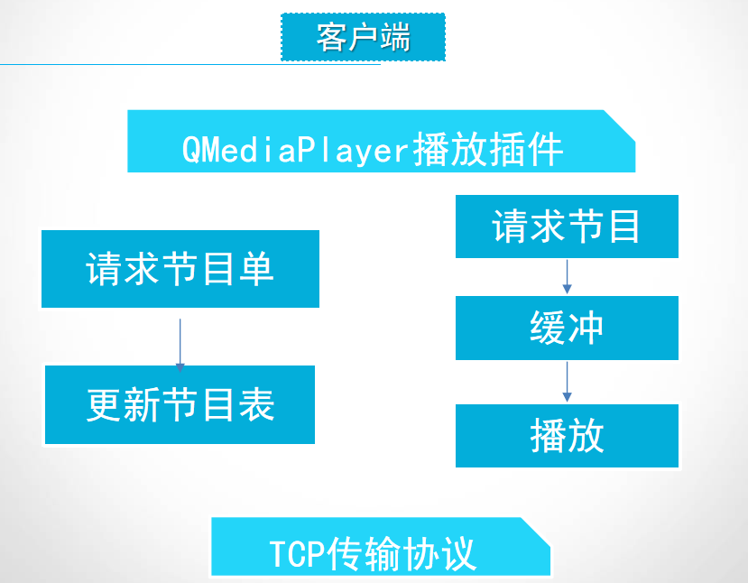
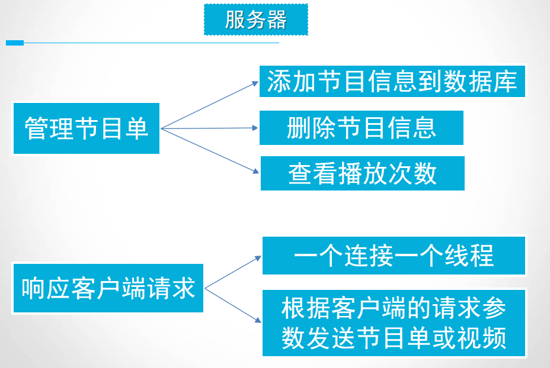
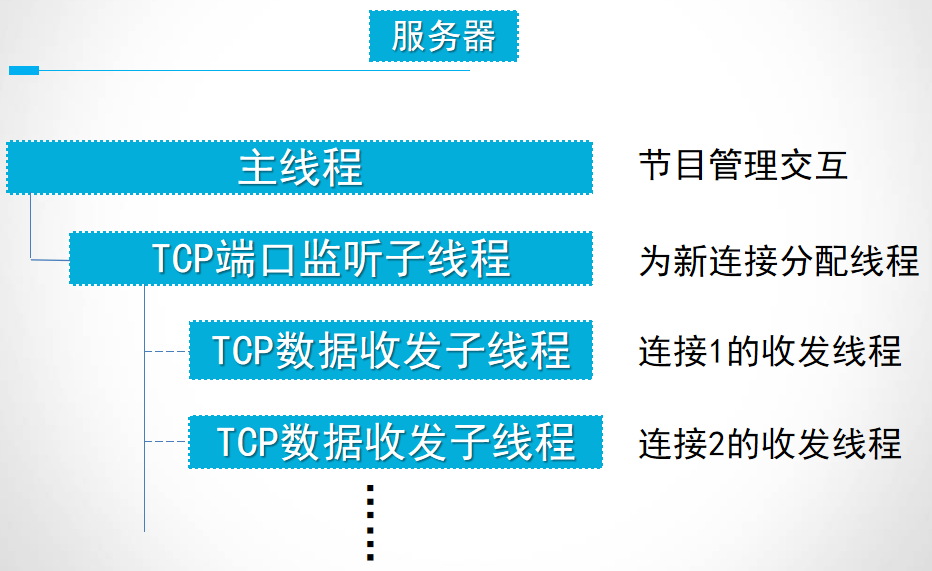
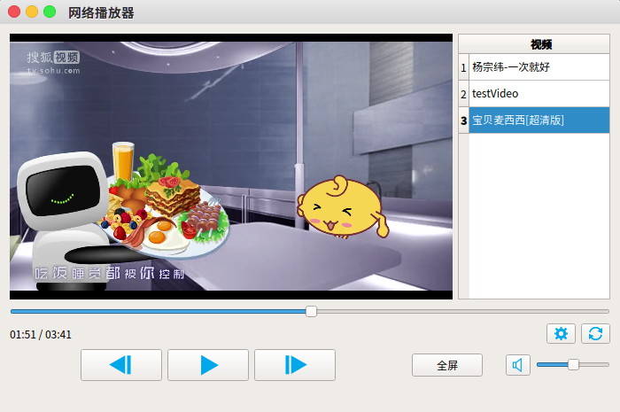
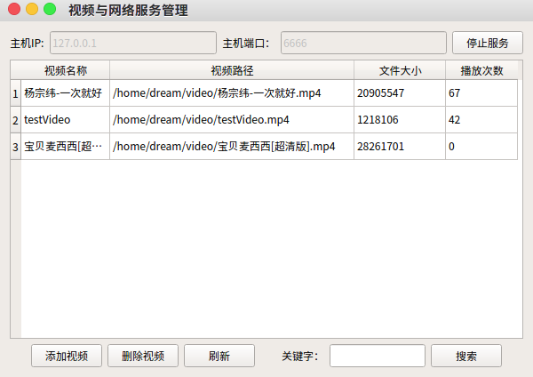

# 基于QT C++的网络播放器服务端和客户端

本项目为基于 Qt C++ 的做网络视频播发器，使用Qt内置的`QMediaPlayer`作为播放插件，使用TCP传输协议发送请求、节目单和视频缓冲。 

 项目分为客户端`player`和服务端`ServiceWidget`部分。 
 客户端主要功能：连接到指定服务器、更新播放清单、点播视频。 
 服务端主要功能：视频库管理、服务端口监听、多线程实现多用户的视频数据发送。

 # 使用
 客户端`player`和服务端`ServiceWidget`均为[Qt Creator](https://www.qt.io/zh-cn/product/development-tools)项目，导入到`Qt Creator`即可使用。 
 `videos_videoInfo.sql`为服务端[MySQL](https://www.mysql.com/cn/downloads/)视频管理表格导出文件，导入到`MySQL`即可。

# 框架
1. 客户端：

2. 服务端

# 界面展示
Player:

Server:

